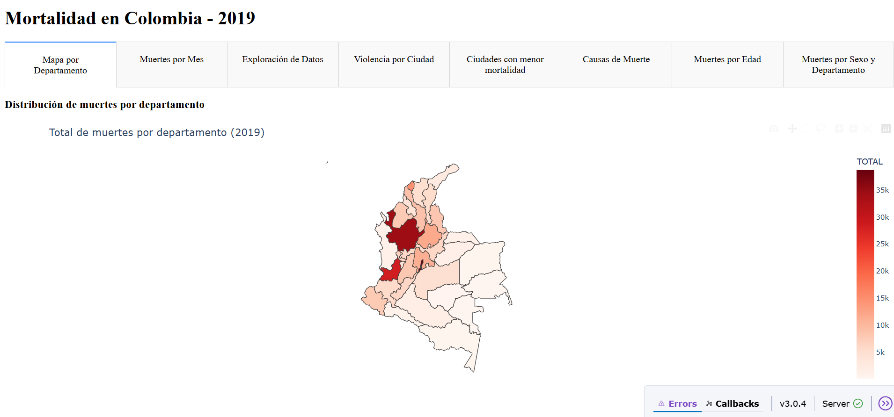
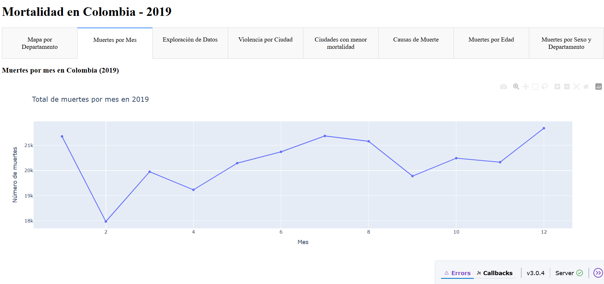
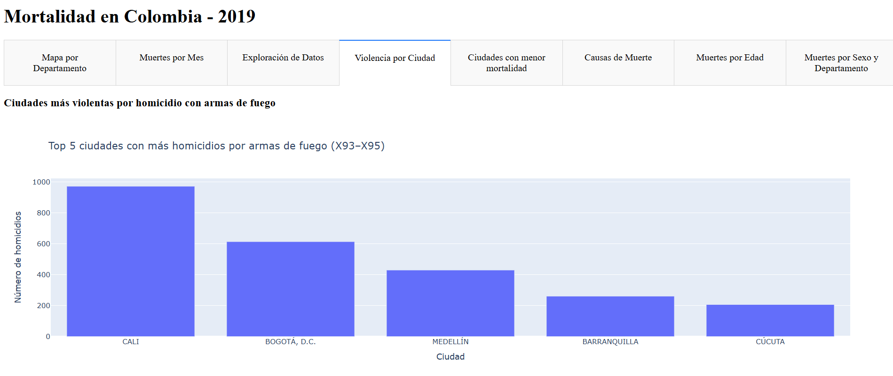
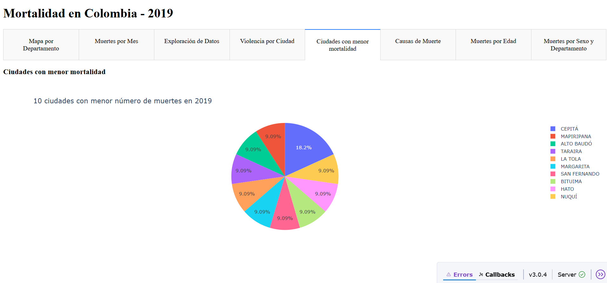
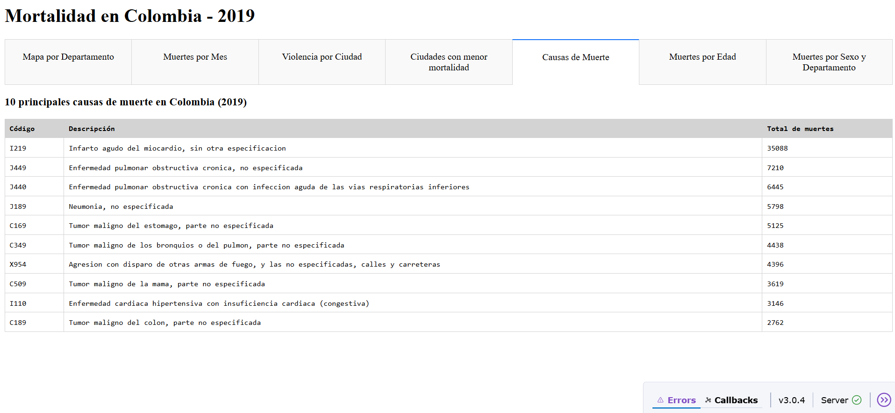
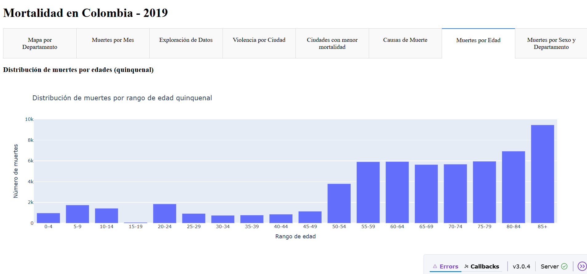
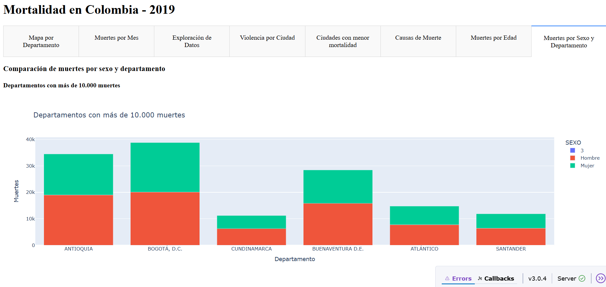
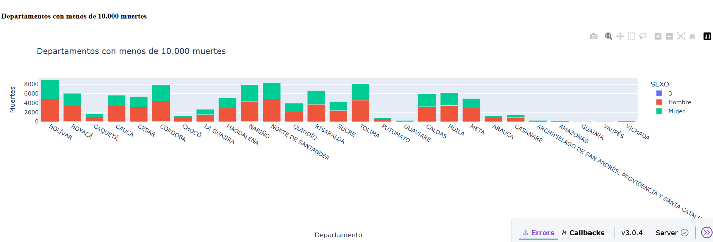

# Análisis de Mortalidad en Colombia 2019

## Autor
**Javier Sánchez**  
Asignatura: APLICACIONES I 
Fecha: Mayo de 2025

---

## 📘 Introducción

Este proyecto consiste en el desarrollo de una aplicación web interactiva que permite analizar y visualizar datos de mortalidad en Colombia para el año 2019. El objetivo principal es explorar patrones y comportamientos relevantes en torno a la distribución de muertes por edad, sexo, causa, ubicación geográfica y otros factores demográficos.

La solución fue implementada utilizando **Python** y el framework **Dash** de Plotly, una biblioteca que permite construir dashboards web interactivos de manera sencilla. Estas tecnologías brindan una alternativa eficiente para presentar informes visuales dinámicos sin necesidad de experiencia avanzada en desarrollo frontend, haciendo uso de estructuras modulares, componentes reutilizables y una arquitectura basada en callbacks y layouts.

---

## 🛠️ Desarrollo de la Aplicación

La aplicación se construyó de manera modular, utilizando un entorno virtual de Python con dependencias declaradas en `requirements.txt`, y desplegable en plataformas PaaS como Render.

El sistema cuenta con múltiples componentes visuales, organizados en pestañas dentro de un layout principal. Cada componente se encuentra en un archivo independiente dentro del directorio `components/`, lo que facilita su mantenimiento y evolución.

Se procesaron datos provenientes de archivos oficiales en formato Excel y GeoJSON, los cuales se cargan y transforman mediante funciones ubicadas en el módulo `utils/data_loader.py`.

A continuación se muestran las vistas principales del sistema:

### 🗺️ Distribución de muertes por departamento

Permite observar el total de muertes en cada departamento de Colombia, utilizando un mapa coroplético basado en datos geoespaciales. Esta visualización facilita identificar regiones con alta o baja mortalidad de forma intuitiva.

---

### 📈 Muertes por mes

Representa la evolución mensual de las muertes durante el año 2019, lo que permite analizar estacionalidades o anomalías temporales.

---

### 🔫 Ciudades más violentas por homicidio (X93–X95)

Gráfico de barras con las 5 ciudades con más homicidios por armas de fuego, filtrando causas CIE-10 que inician por `X93`, `X94` y `X95`.

---

### 🧘 Ciudades con menor mortalidad

Gráfico circular que presenta las 10 ciudades con menor número total de muertes registradas en 2019.

---

### 📋 Principales causas de muerte

Tabla ordenada con las 10 causas más frecuentes, incluyendo código CIE-10, descripción y cantidad de casos.

---

### 📊 Distribución por rango de edad quinquenal

Histograma que agrupa los fallecimientos en intervalos de 5 años, lo que permite identificar los grupos de edad con mayor incidencia de mortalidad.  
> Nota: se ha limitado el eje Y a 10.000 para mejorar la visibilidad comparativa.

---

### 🚻 Muertes por sexo y departamento

#### Departamentos con más de 10.000 muertes

#### Departamentos con menos de 10.000 muertes

Visualización apilada que compara la distribución por sexo en cada región. Esta segmentación facilita analizar la diferencia relativa en la mortalidad masculina y femenina.

---

## 🔍 Interpretación de Resultados

La aplicación muestra de forma clara y estructurada varias tendencias relevantes:

- **Antioquia, Bogotá y Valle del Cauca** concentran la mayor cantidad de muertes, como es esperable por su densidad poblacional.
- Los **homicidios por arma de fuego** se concentran principalmente en ciertas ciudades con contextos de violencia histórica.
- La **mortalidad aumenta progresivamente con la edad**, destacando los grupos mayores de 60 años como los más afectados.
- Se identifican **diferencias entre sexos** en varios departamentos, siendo más marcadas en zonas urbanas densamente pobladas.
- Algunas ciudades presentan tasas bajas de mortalidad, lo cual podría estar vinculado con factores geográficos, demográficos o calidad de datos.

---

## 🧩 Conclusión

El uso de Dash y Python permitió desarrollar una aplicación interactiva, modular y visualmente clara, ideal para la exploración y análisis de datos reales. La estructura empleada permite escalar fácilmente la solución para otros años o temáticas, fomentando el uso de dashboards analíticos en el contexto educativo, institucional o profesional.

